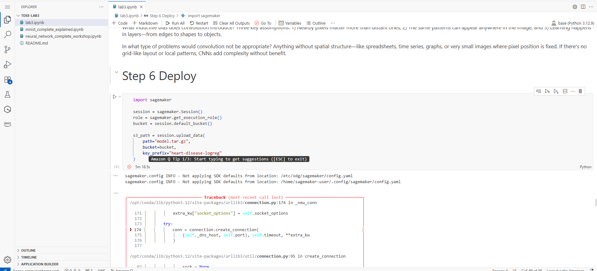
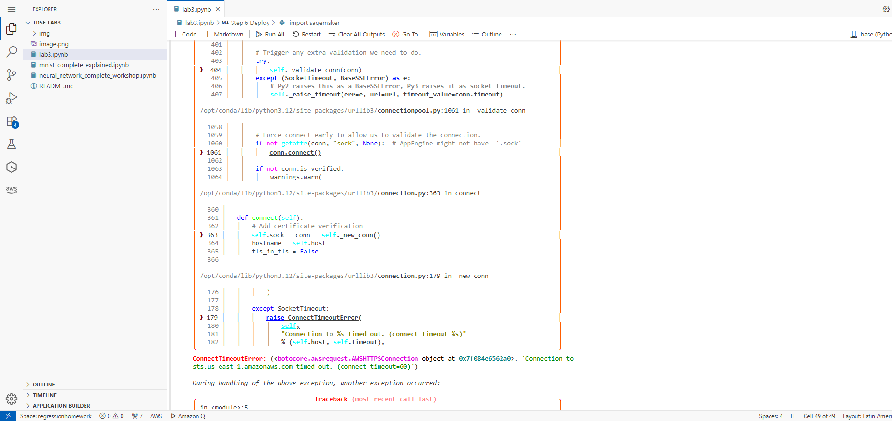

# TDSE LAB2 Manuel Alejandro Guarnizo

In this lab, I completed a full pipeline for image classification using Fashion MNIST. I began with dataset exploration, examining size, distribution, and preprocessing needs like normalization and reshaping. I then implemented a baseline fully connected network to establish a performance reference. Next, I designed a custom CNN architecture from scratch, justifying choices for layers, kernel sizes, and activation functions. I conducted controlled experiments on convolutional depth, comparing 1, 2, and 3-layer networks, and analyzed their performance trade-offs. After training and evaluating all models, I interpreted the results, explaining why CNNs outperform dense networks, what inductive biases they introduce, and when convolutional approaches are not suitable.


## In this repository are the notebooks:
lab3.ipynb

## Project Overview
This repository contains one Jupyter Notebooks that demonstrate:
    diferent ways of model training


## Setup Instructions

### Requirements
- **Python 3.10+** (compatible with most Python 3.x versions)
- **Jupyter Notebook** or **JupyterLab**
- Python libraries: `numpy`, `matplotlib`, `pandas`

### Installation Steps
1. Clone the repository:
   ```bash
   git clone <repository-url>

### Deploy
Trying to deploy there was an error where i wasn't able to connect to ana amazon point important for the deploy





